# 🎌 One Pace Premium — Kodi Add-on

Kodi plugin (`plugin.video.onepacepremium`) and its update repository (`repository.onepacepremium`). Watch the complete One Pace catalog with your debrid service directly inside Kodi.

## 📋 Prerequisites

**For torrent/P2P streams** (optional — debrid streams work without this):

1. Go to **https://elementum.surge.sh/** and download the **Universal** version under *Elementum Downloads*
2. In Kodi: **Add-ons** ➔ **Install from zip file** ➔ select the downloaded zip
3. Elementum is now installed and ready for torrent playback

> Debrid streams work without Elementum.

## 🚀 Installation (Recommended)

Using the repository ensures you receive automatic updates.

1. **Add Source**: Go to **Settings** ➔ **File manager** ➔ **Add source**.
2. **Enter URL**: Enter the URL below and name it `One Pace Premium`.

   ```
   https://6ip.github.io/onepace-premium-kodi
   ```
3. **Install Repository**: Go to **Add-ons** ➔ **Install from zip file** ➔ select `One Pace Premium` ➔ install `repository.onepacepremium-X.Y.Z.zip`.
4. **Install Add-on**: Go to **Install from repository** ➔ **One Pace Premium Repository** ➔ **Video add-ons** ➔ **One Pace Premium** ➔ **Install**.

> If step 4 fails right after installing the repository, restart Kodi and try again.

<details>
<summary>🖼️ Click to view the step-by-step visual guide (17 screenshots)</summary>

**1.** Click the **Gear Icon** in the top-left corner of the Kodi home screen.

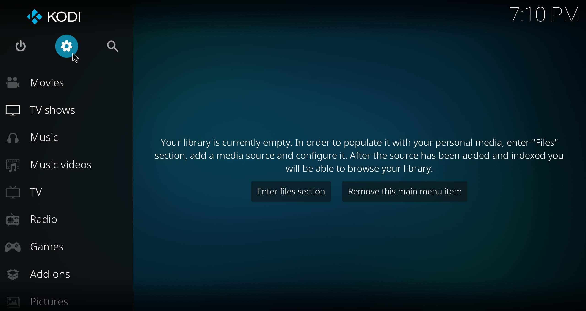

**2.** Select **File Manager**.

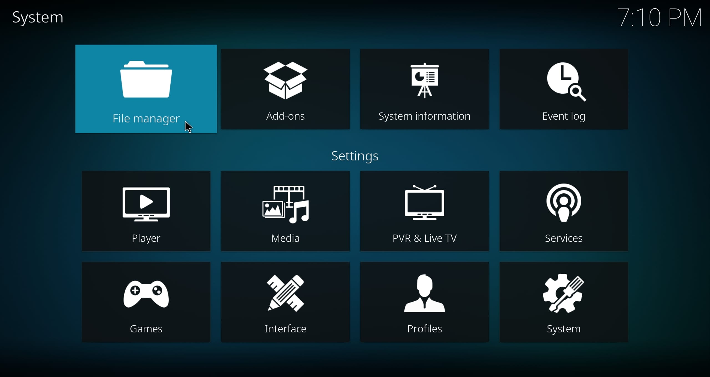

**3.** Click **Add source**.

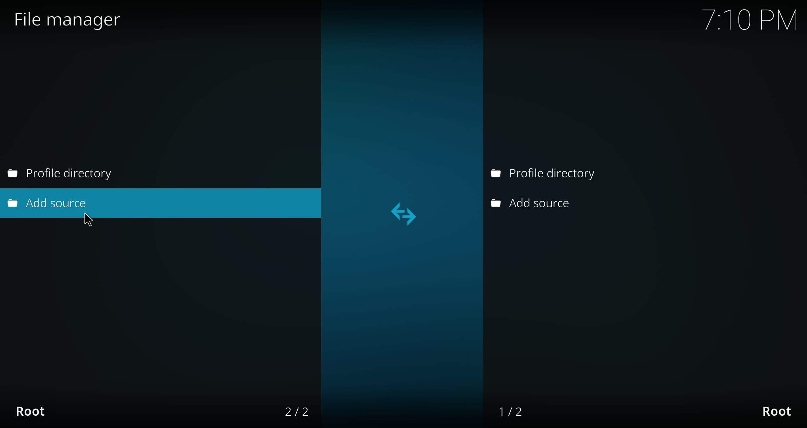

**4.** Type `https://6ip.github.io/onepace-premium-kodi/` in the top box and `onepace premium` in the bottom box. Press **OK** to add the source.

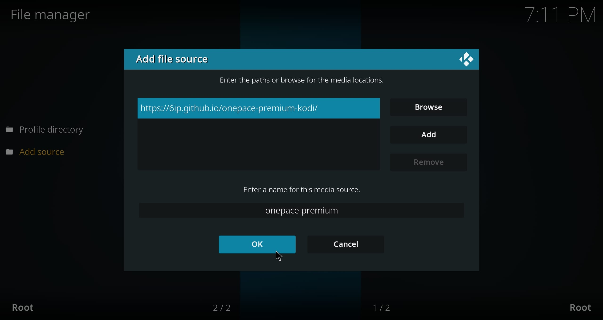

Now that we've added the source, let's use it to install the One Pace Premium repository.

**5.** Go back to the System menu and this time select **Add-ons**.

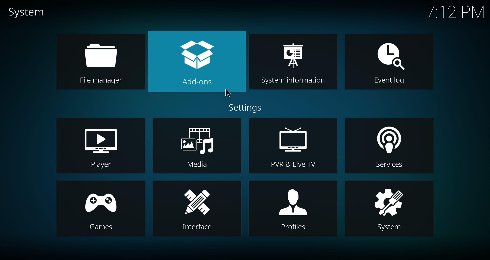

**6.** Click **Install from zip file**.

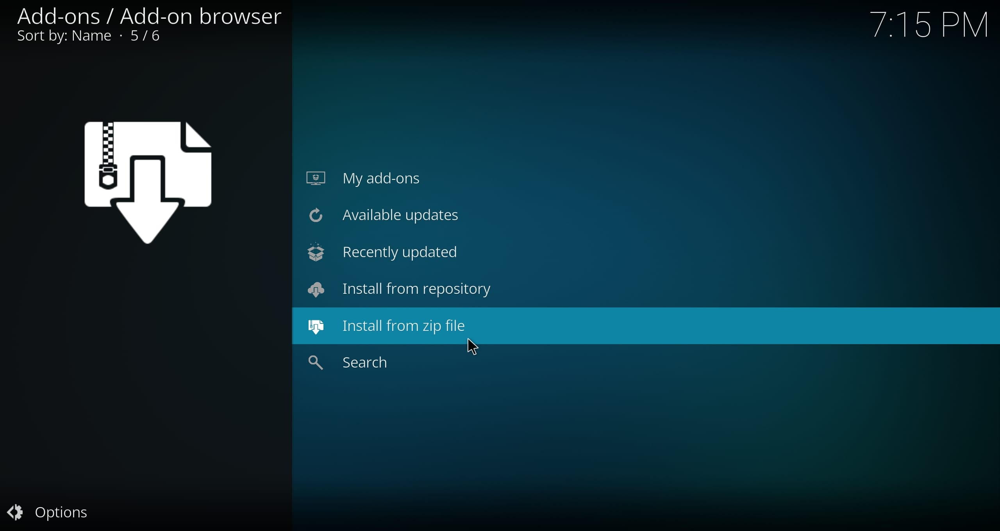

If **Unknown Sources** is **enabled**, you'll see a message about the auto-update feature. Just press **Yes** to continue.

However, if **Unknown Sources** is **disabled**, you'll see a "Disabled" notification. You must follow these steps:
- Press the **Settings** button on the notification
- Enable **Show Notifications** and **Unknown Sources**
- You'll see a "Warning" notification — press **Yes**
- Press **Back**
- Click **Install from zip file** again

**7.** Now select **onepace premium**.

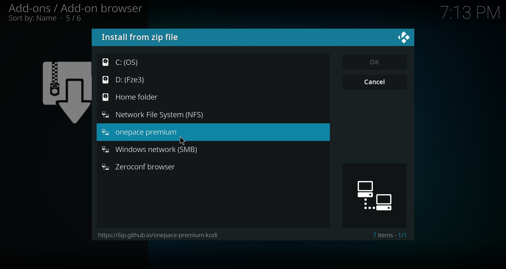

**8.** Click **repository.onepacepremium-X.Y.Z.zip** to download and install the repository.

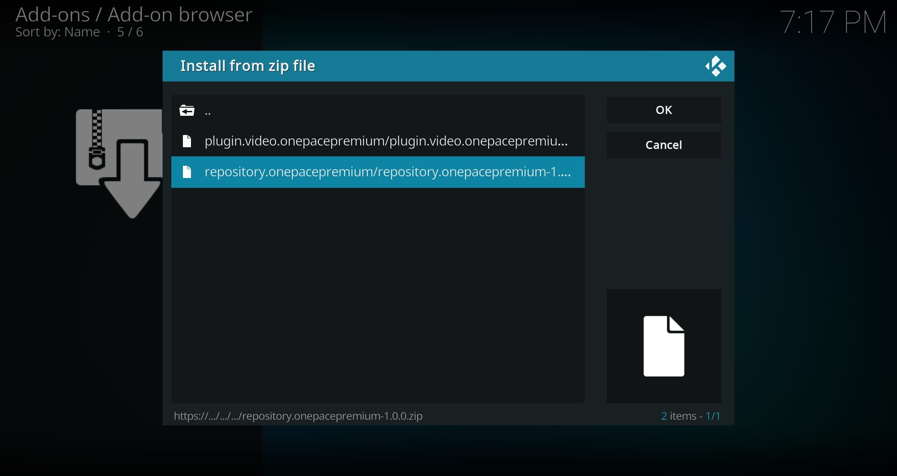

The repository is now installed. Next, we'll use it to download and install the One Pace Premium add-on and its dependencies.

**9.** Select **Install from repository**.

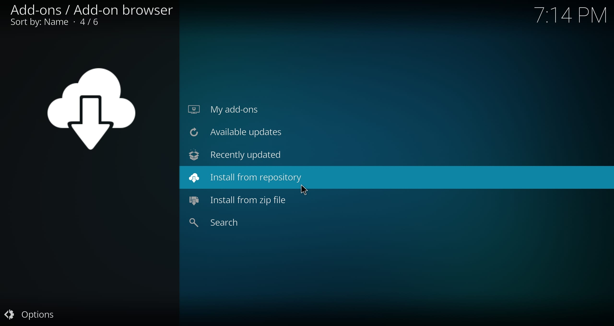

**10.** Click **One Pace Premium Repository**.

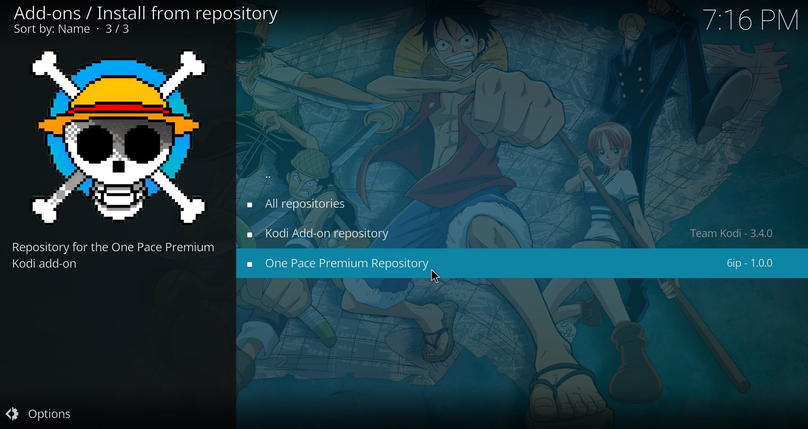

**11.** Select **Video add-ons**.

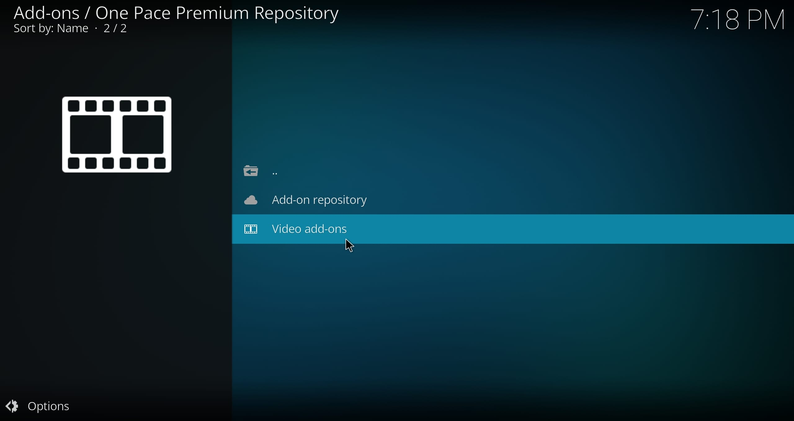

**12.** Now select **One Pace Premium**.

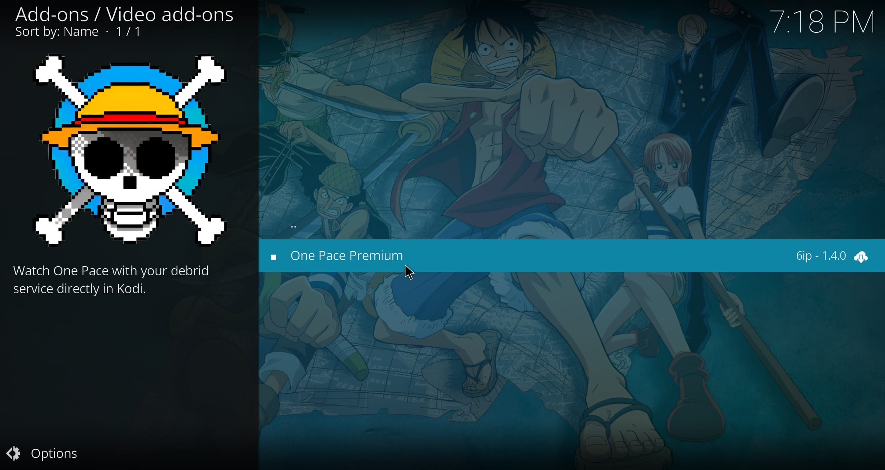

> If it fails right after installing the repository, restart Kodi and try again.

**13.** Press the **Install** button.

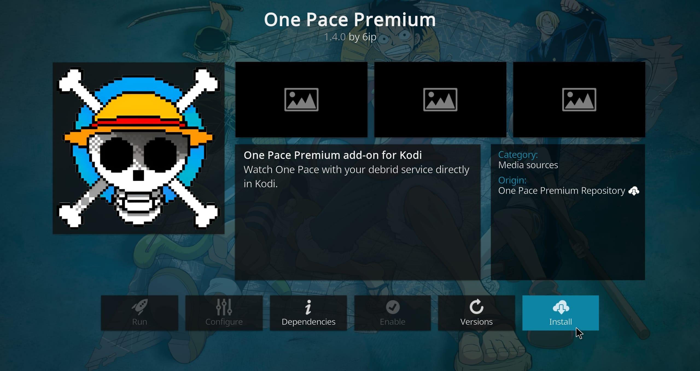

**14.** Press **OK** to install One Pace Premium and its dependencies.

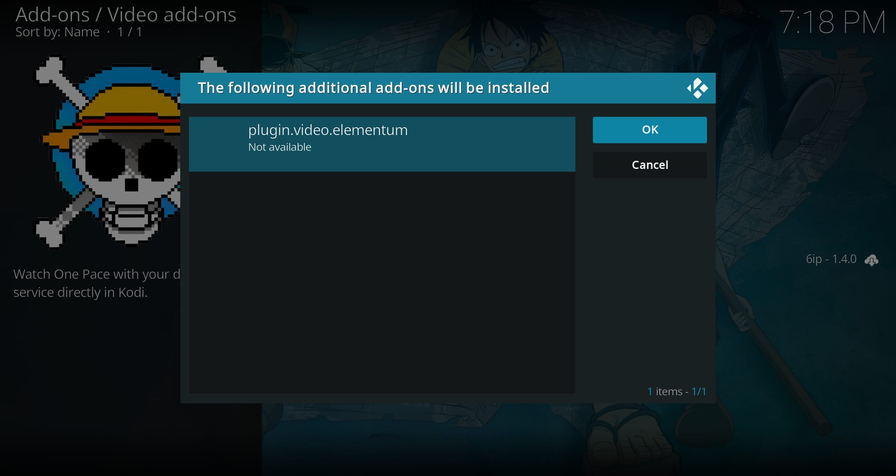

Wait a few seconds for the add-on to download — you'll see a notification when installation is complete.

We've now installed One Pace Premium on Kodi, but we still need to authorize a debrid account, or the add-on won't be able to find video sources.

**15.** Press the **Configure** button.

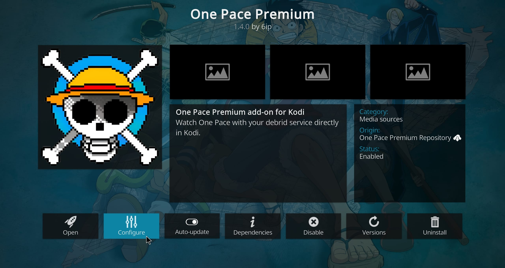

**16.** Click **Configure/Reconfigure** and follow the on-screen setup steps.

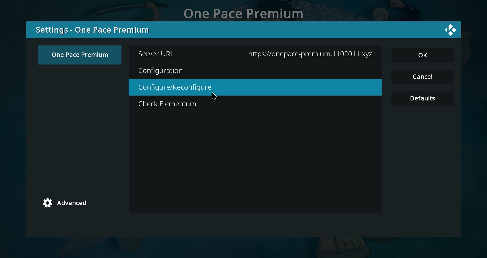

**17.** After completing the configuration, go back to Kodi and press **OK** to continue.

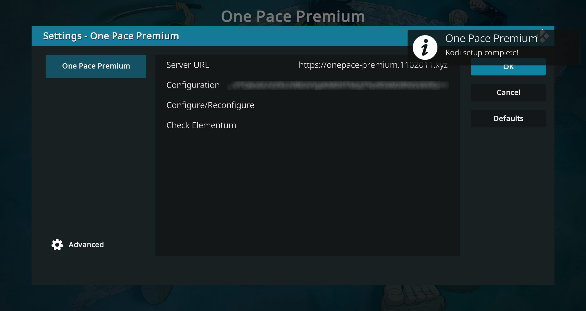

**All done!** You are now ready to stream content with the One Pace Premium Kodi add-on.

</details>

## ⚙️ Configuration

Once installed, link the add-on to your account:

1. Go to **Add-ons** ➔ **My add-ons** ➔ **Video add-ons** ➔ **One Pace Premium** ➔ **Configure**.
2. Click **Configure/Reconfigure**.
3. An **8-character hex setup code** will appear (e.g., `1a2b3c4d`).
4. Open the configuration page on your phone or browser — the URL is shown on screen.
5. Select your debrid provider and paste your API key.
6. Click **Install Addon** — Kodi detects the setup automatically.

> Alternatively, open the configuration page manually, click **Setup Kodi** from the install menu, and enter the code shown in Kodi.

## 📦 Manual Installation

*You will not receive automatic updates with this method.*

1. Download the latest plugin zip from the [One Pace Premium Kodi Repository](https://6ip.github.io/onepace-premium-kodi/).
2. Go to **Add-ons** ➔ **Install from zip file** ➔ select the downloaded zip.
3. Follow the **Configuration** steps above.

---

## 🛠️ Development & Building

```sh
make          # Full build: add-on + repository
make package  # Add-on zip only
```

### Build Outputs (`dist/`)
```
dist/
├── addons.xml + addons.xml.md5
├── plugin.video.onepacepremium/
│   ├── addon.xml
│   └── plugin.video.onepacepremium-X.Y.Z.zip
├── repository.onepacepremium/
│   ├── addon.xml
│   └── repository.onepacepremium-X.Y.Z.zip
└── index.html
```
